##### 套接字成对出现，但是一个套接字内部有两个缓冲区分别是读缓冲区 写缓冲区
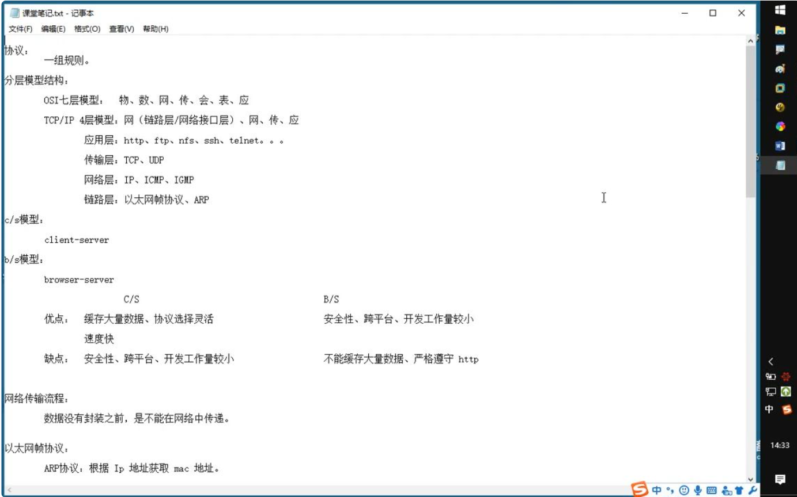
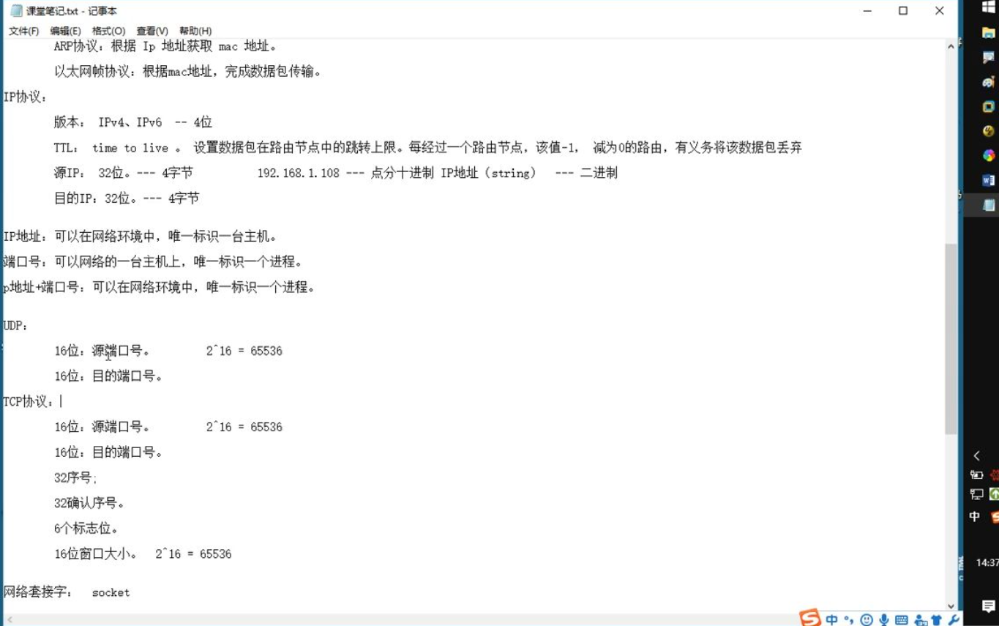
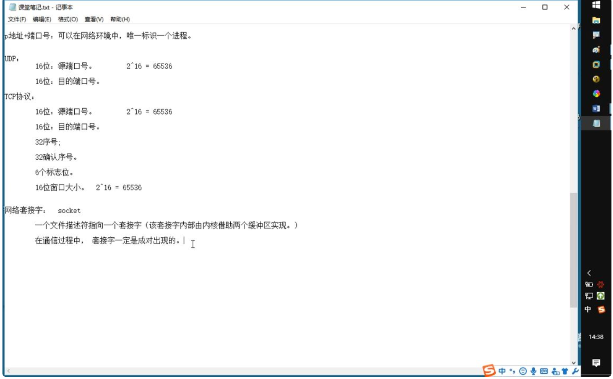
> 套接字成对出现，但是一个套接字内部有两个缓冲区分别是读缓冲区 写缓冲区

##### 基础知识1-网络编程复习回顾
> 网络字节序
> 计算机内部都是采用小端模式（高位存高地址，低位存底地址）存储数据。但是在网络当中采用大端模式来存储数据。所以网络中传输的IP地址  port端口 MAC地址等等回因为这些历史遗留原因不能进行读取。
> 所以就需要一些函数来进行转换：htonl, htons, ntohl, ntohs - convert values between host and network byte order


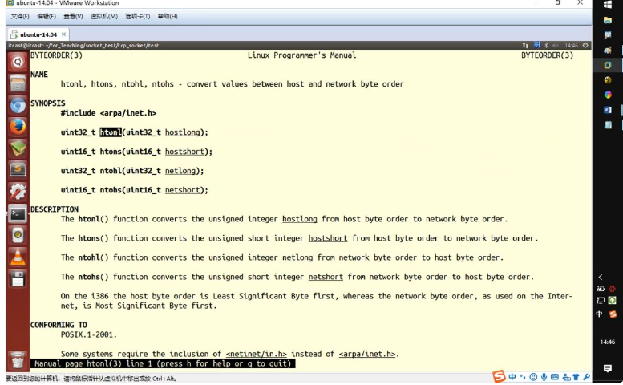
> 上面是四个转换函数。
> h指的是host, n指得是network, l指得是 longlong(在32位机器上是4字节 表示IP地址)，s是short（2字节 表示端口）

上述讲的四个函数是最原始的函数，现阶段有对上述四个函数的封装实现 直接点分十进制法字符串（string）转换为 二进制 IP地址。
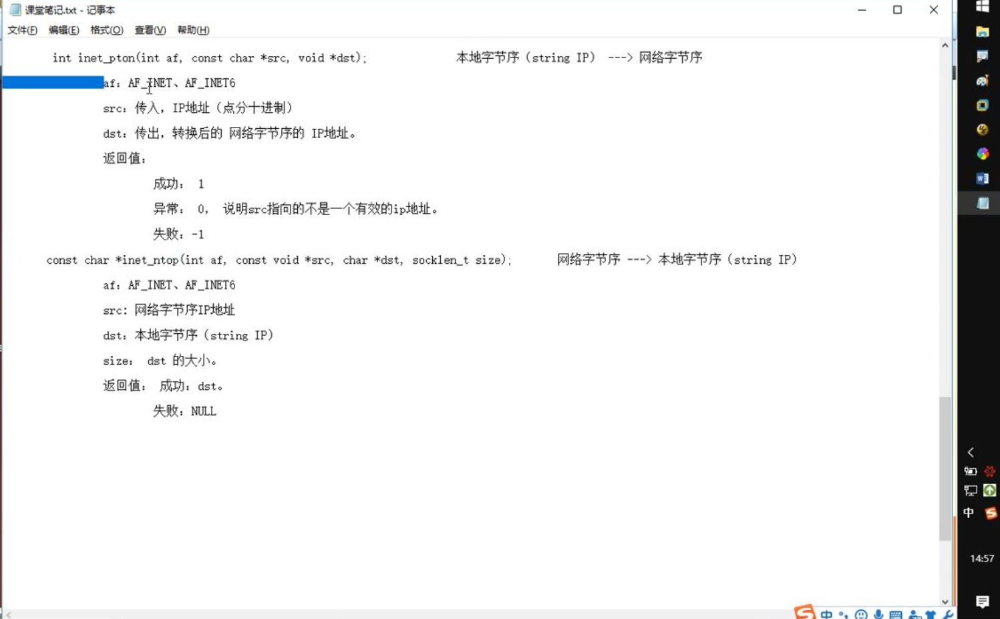

> 方法如上，有`int inet_pton（int af, const char* src, void *dst）`和 `const char* inet_ntop(int af, const void* src, char* dst, socklen_t size)`;


- int inet_pton（int af, const char* src, void *dst）将点分十进制字符串转换为网络字节序的二进制地址。

| 参数 | 类型 | 说明 |
|------|------|------|
| `af` | `int` | 地址族（Address Family）<br>• `AF_INET`：IPv4<br>• `AF_INET6`：IPv6 |
| `src` | `const char*` | 源字符串（点分十进制格式）<br>例如："192.168.1.1" 或 "::1" |
| `dst` | `void*` | 目标缓冲区<br>• IPv4：指向 `struct in_addr` 或 `in_addr_t`（即 `uint32_t`）<br>• IPv6：指向 `struct in6_addr` |

| 返回值 | 含义 |
|--------|------|
| `1` | 成功：字符串已转换为二进制地址 |
| `0` | 失败：输入字符串格式无效 |
| `-1` | 错误：`af` 参数无效，设置 `errno` |
- const char* inet_ntop(int af, const void* src, char* dst, socklen_t size) 将网络字节序的二进制地址转换为点分十进制字符串。返回的字符串其实和dst的内容是相同的

| 参数 | 类型 | 说明 |
|------|------|------|
| `af` | `int` | 地址族<br>• `AF_INET`：IPv4<br>• `AF_INET6`：IPv6 |
| `src` | `const void*` | 源二进制地址<br>• IPv4：指向 `struct in_addr` 或 `in_addr_t`<br>• IPv6：指向 `struct in6_addr` |
| `dst` | `char*` | 目标字符串缓冲区 |
| `size` | `socklen_t` | 缓冲区大小<br>• IPv4：至少 `INET_ADDRSTRLEN`（16字节）<br>• IPv6：至少 `INET6_ADDRSTRLEN`（46字节） |


##### socket addr地址结构：
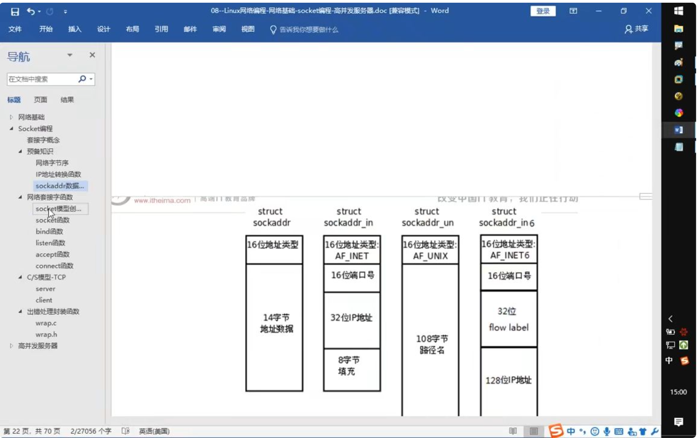
> 上图是四个关于socketaddr的地址结构，左边两个短的是IPv4的，右边是IPv6，但是最左边被弃用了，现在使用struct sockarrd_in作为参数传递使用，但有些时候还需要强转成socketaddr。

具体的编程逻辑
```cpp
struct sockaddr_in addr;
// socketaddr_in有三个都要赋值，分别是
// sin_family表示IPv4/6
// sin_port 端口号
// sin_addr(struct) IP地址
addr.sin_family =  AF_INET //(这里写成AF_INET表示IPv4，写成AF_INET表示IPv4)
addr.sin_port = htons(9527);

//填充IP地址的两种方式
int dst;
inet_pton(AF_INET, "192.111.11.11", (void*)&dst)
addr.sin_addr.s_addr = dst;
// 第二种方式
addr.sin_addr.s_addr = htonl(INADDR_ANY); // INADDR_ANY是任意一个有效的IP地址，为字节序的，这个时候需要将它转换为网络字节序

bind(fd, (struct sockaddr *)&addr, sizeof(struct sockaddr_in));
```

##### 套接字通信
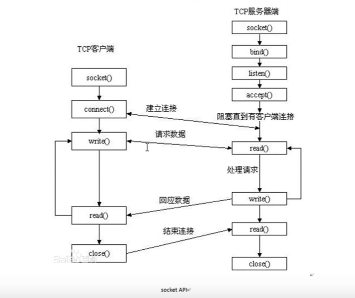
> socket通信的api及流程如上图所示，整个过程会创建出3个`socket`,客户端一个，服务端两个。服务端首先会使用`socket()`函数创建一个套接字，然后使用`bind()`函数设置套接字的参数，之后使用`listen()`函数设置**同时进行三次握手的客户端连接数量**。之后使用`accept()`阻塞监听。等到监听到连接之后再创建一个`socket`做后续的读写操作。
> 客户端这边也是直接使用`socket()`创建套接字，然后调用`connect()`函数设置套接字连接的参数 (IP地址，端口号)

- socket函数和bind函数
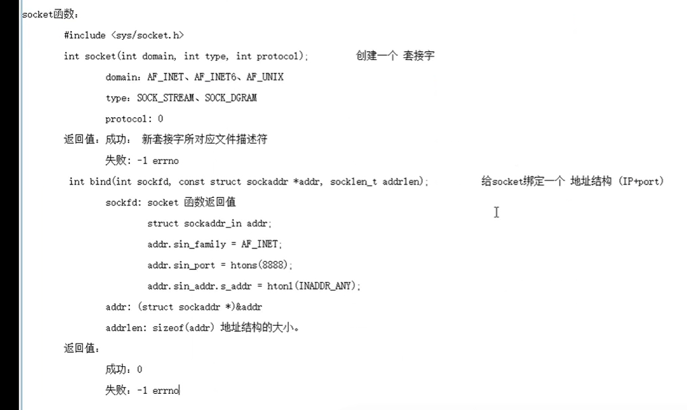
> 具体使用方法在图上写的很清楚，最好能记下来函数的使用方法和传递的参数。

- listen函数和accept函数
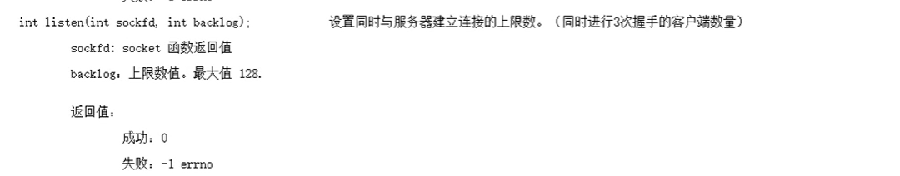
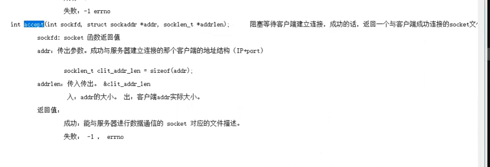
> 注意这些函数的返回值
> `listen`函数负责设置同时与服务器建立连接的上限数
> `accept`函数负责阻塞监听

- connect函数
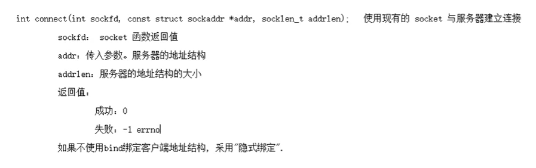
> `connect()`函数是客户端主动向服务端发起连接


##### CS模式下的TCP通信流程

```text
server: 
	socket	# 创建Socket
	bind	# 绑定地址结构
	listen # 设置监听上限
	accept # 阻塞监听客户端连接
	read() # 读取socket缓冲区 获取客户端数据
	将数据进行处理
	write() # 写入socket 缓冲区 发送数据
	close() # read读取到0，表示传输层收到了FIN报文，此时传输层向应用层发送0表示数据读取结束，客户端向服务器端的连接关闭。
client
	socket()	# 创建socket
	connect()	# 与服务器建立连接
	write()	# 写数据到socket
	read() 	# 读取数据
	显示读取结果
	close() # 关闭连接
```


